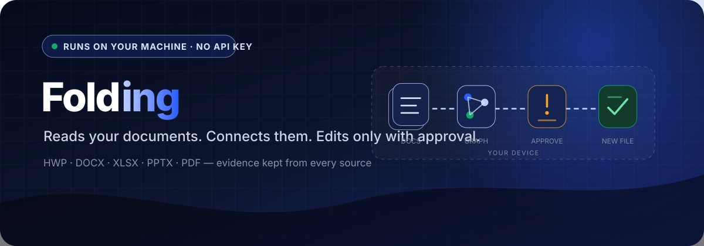

  

  <a href="https://github.com/dotenv-uploaded/_FOLDING_"><strong>Source code</strong></a> ·
  <a href="https://github.com/dotenv-uploaded/_FOLDING_#architecture"><strong>Architecture</strong></a> ·
  <a href="https://github.com/dotenv-uploaded/_FOLDING_/blob/main/services/agent/docs/WRITE_TOOLS_DESIGN.md"><strong>Document writers</strong></a> ·
  <a href="https://github.com/dotenv-uploaded/_FOLDING_/actions/workflows/desktop-installers.yml"><strong>Installers</strong></a>

## Your documents stay on your machine

Business documents are scattered across formats and folders, and applying what you find back into a
document usually means stitching several disconnected tools together. **Folding** turns the local folders
you choose into a versioned knowledge base, so you can ask questions in natural language, inspect the
evidence in the original files, and edit documents in the same conversation.

The default mode is **fully local**. Conversion, analysis, retrieval, assembly, and editing all run on the
user's computer, and no third-party AI API key is required. Signing in establishes *who you are*; choosing
a folder establishes *what the application may read*. Signing in never grants access to local files.

> Built at the 2026 Codegate AI START UP Hackathon.

## What it removes

| Before | After |
| --- | --- |
| Hunt through folders to find the relevant document | Ask in natural language across the registered folders |
| Trust a summary with no way to check it | Every claim carries the sentence it came from |
| Open a converter, an editor, and a chat window | Read, connect, and edit in one conversation |
| Edit HWP or DOCX with a generic text editor and lose layout | Format-specific writers that preserve formatting |
| Send private documents to a cloud model | Local inference by default, no API key |

## Relationships you can check

Converted HWP, DOCX, and PDF files do not contain links to one another, so counting explicit links would
leave a graph of isolated nodes. Folding derives relationships from **entities that several documents
share**, then keeps each side honest:

| Stage | Behavior |
| --- | --- |
| Drop ubiquitous entities | An entity that appears in nearly every document connects everything to everything and discriminates nothing. |
| Limit neighbors | Each document links only to a bounded number of documents with the strongest overlap. |
| Preserve evidence | Every shared entity is stored with the sentence in which **each** source document mentions it. |

Documents connected through relationships form a network and share a color, and a network is named after
the folder holding the most of its members rather than by hand. The same color calculation drives the
document tree, so a network looks the same in both views. Expanding a relationship shows the supporting
sentences side by side, because entity overlap is not directional.

## Edits that cannot quietly corrupt a file

The agent is steered toward format-specific writers rather than a generic text editor.

| Format | Approach |
| --- | --- |
| HWP | Writes by table-cell index and exports a new file |
| DOCX · XLSX · PPTX | Updates paragraphs, cells, and shapes without touching formulas |
| PDF | Does not pretend body text is safely editable; produces an annotated copy |

Every writer obeys three rules: **never overwrite the source file**, **reopen and reparse the saved result**
to confirm the requested change is present, and **never leave partial output** that looks complete.

## An approval gate instead of a short tool list

The agent is not limited to a handful of safe tools. Instead every tool invocation passes through an
approval gate that shows what the agent intends to do, the risk, and **the user's original request**.

| Level | Action | Policy |
| --- | --- | --- |
| SAFE | Read and search | Automatic — there is nothing to undo, and constant prompts cause approval fatigue |
| CAUTION | Create or modify files | Needs approval: local state changes, but it is reversible |
| DANGER | Irreversible or external action | Needs approval with an explicit reason |

Prompt injection cannot be detected perfectly, but a user who asked for a summary can recognize that an
unexpected destructive command is unrelated to their request. **No response is treated as denied.**

## Stack

| Area | Technology |
| --- | --- |
| Desktop | Electron, React, TypeScript |
| Services | FastAPI, Python |
| Local inference | Ollama or LM Studio over an OpenAI-compatible loopback API |
| Documents | HWP, DOCX, XLSX, PPTX, PDF conversion and writers |
| Packaging | electron-builder, PyInstaller sidecars, GitHub Actions |

Folding ships one self-contained artifact per operating system and architecture, because an OS cannot run
another OS's native binaries. Before the interface opens, every platform checks OS, architecture, memory,
disk, GPU availability, and bundled native files, and writes the result to a diagnostics file.

## Repositories

- **[`_FOLDING_`](https://github.com/dotenv-uploaded/_FOLDING_)** — the complete program: desktop
  application, local agent, document conversion, and the wiki builder. Modules were imported with
  `git subtree`, so the original commit history is still reachable through `git log`.
- `folding-cloud-api` — OAuth, session, and subscription services. Private, and deployed to a server
  rather than a user device because it holds secrets that must never be distributed locally.

## Team

Four students, team **.env 올려버린 팀**.

[@ghdtjdwn](https://github.com/ghdtjdwn) ·
[@Mingoomato](https://github.com/Mingoomato) ·
[@thddydgnl](https://github.com/thddydgnl) ·
[@Woochang4862](https://github.com/Woochang4862)

  <a href="https://github.com/dotenv-uploaded/_FOLDING_"><strong>Read the full documentation →</strong></a>

