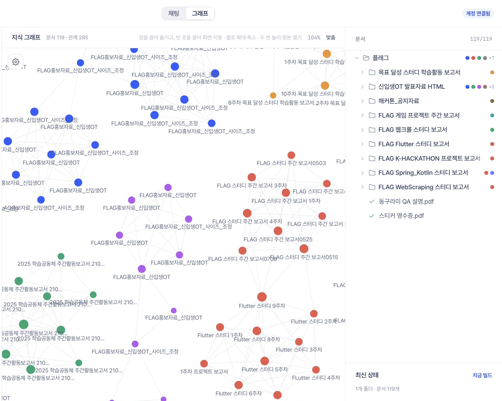

  <a href="https://github.com/dotenv-uploaded/_FOLDING_">
    <picture>
      <source media="(prefers-color-scheme: dark)" srcset="https://raw.githubusercontent.com/dotenv-uploaded/_FOLDING_/main/docs/assets/folding-logo-white.png">
      
    </picture>
  </a>

  <strong>Your work is already in your documents. Folding helps you find it, connect it, and change it safely.</strong> 
  A local-first desktop workspace for HWP, Office, PDF, and the folders around them.

  <a href="https://github.com/dotenv-uploaded/_FOLDING_"><strong>Explore Folding</strong></a> ·
  <a href="https://github.com/dotenv-uploaded/_FOLDING_#running-locally">Run locally</a> ·
  <a href="https://github.com/dotenv-uploaded/_FOLDING_/actions/workflows/desktop-installers.yml">Desktop builds</a>

  

## One workspace from question to finished document

Choose a folder on your computer. Folding turns the supported files inside it into a searchable, versioned
workspace without giving a cloud service general access to that folder. From the same desktop app, you can:

1. **Ask across files.** Search HWP, Word, Excel, PowerPoint, PDF, CSV, HTML, Markdown, and text in natural
   language, then trace an answer back to the source passage.
2. **See how documents are related.** The graph connects files that share meaningful entities, groups them into
   networks, and keeps the supporting sentence from both sides of every relationship.
3. **Request a change in plain language.** Folding selects a format-specific writer, shows the intended action,
   and waits when the request would change local state.
4. **Keep the original safe.** A result is written to a new file, reopened, and checked. A failed operation does
   not leave a partial document that looks complete.

## The graph explains itself

The colors in the screenshot are document networks, not decoration: 119 documents form groups from 285
relationships. Select a connection to see the entities the two files share and the sentence where each file
mentions them. Entities that occur almost everywhere are removed, and each document keeps only its strongest
neighbors, so the graph stays useful instead of connecting everything to everything.

## Editing respects the format

| Document | What Folding does |
| --- | --- |
| HWP | Updates values through an HWP-aware writer and exports a new `.hwp` file. |
| DOCX · XLSX · PPTX | Edits paragraphs, cells, tables, or shapes with format-specific libraries. |
| PDF | Produces an annotated copy instead of pretending the original body text is safely editable. |

Read and search operations can proceed without interruption. Creating, modifying, deleting, or reaching outside
the app crosses an approval gate that shows the proposed action, its risk, and the request that led to it. No
response means no approval.

## Local by default means a concrete boundary

In the default mode, conversion, analysis, retrieval, graph construction, and editing run on the user's computer.
The supported local model is Gemma 4 through the loopback API provided by Ollama or LM Studio, so no third-party AI
API key is required. Signing in can establish identity or licensing; it does not grant access to local folders.
Folder access begins only when the user chooses one in the operating-system picker.

  <a href="https://github.com/ghdtjdwn">@ghdtjdwn</a> ·
  <a href="https://github.com/Mingoomato">@Mingoomato</a> ·
  <a href="https://github.com/thddydgnl">@thddydgnl</a> ·
  <a href="https://github.com/Woochang4862">@Woochang4862</a>

